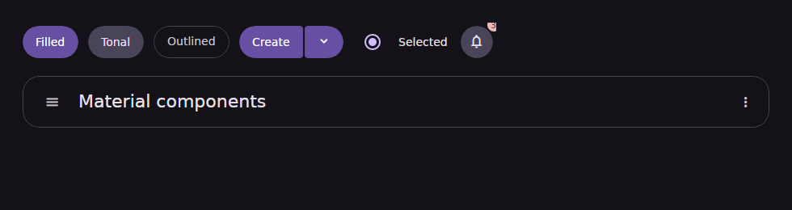
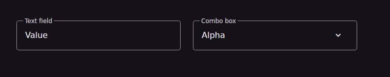
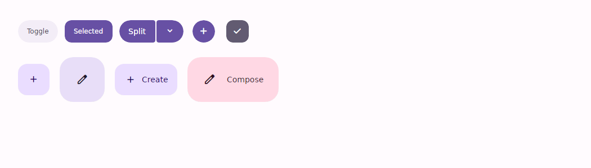
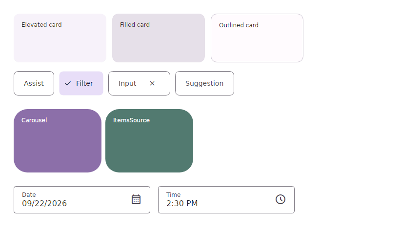
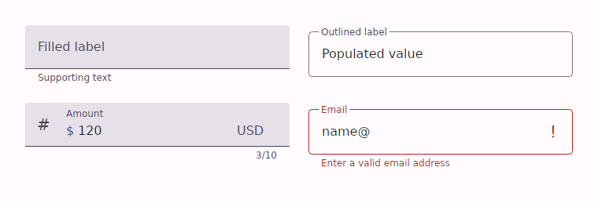
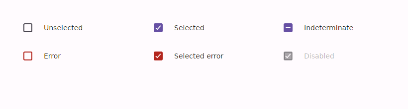
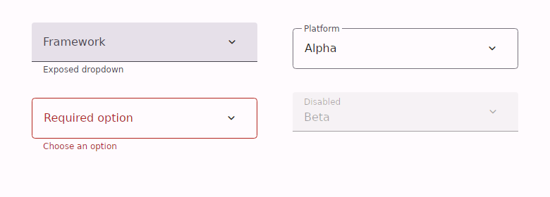

# Md3.Avalonia — Material Design 3 controls for Avalonia 12

一个面向 Avalonia 12 的跨平台 Material 3 / M3 Expressive 控件库与组件 Gallery。项目同时提供核心控件、动态 HCT 主题、Material Symbols provider、Flutter-inspired Extra 控件、桌面窗口适配和 Android single-view Gallery。

> 当前版本：`0.4.1-preview.1`。项目适合预览、内部应用和组件验证；物理 Android/TalkBack、Windows Narrator、macOS VoiceOver、Linux Orca 等外部验收仍需单独签署。

设计原则：

- 每个交互控件使用独立的 `Md*` CLR 类型和 scoped `ControlTheme`；不全局覆盖 Avalonia 原生控件；
- 核心包不依赖 Fluent/Simple theme，尽量复用 Avalonia 原生行为、绑定、键盘和选择模型；
- Material 颜色、字体、形状、状态层、阴影和 motion 通过 token 与 `DynamicResource` 消费；
- Core、Icons、Icons.Lite、Extra、DataGrid、RichEditor 六个包可以独立发布；Extra 和图表能力不强制绑定第三方 vendor；
- RTL、现有 accessibility 和多平台适配代码会持续保留；当前开发优先级暂不把完整 RTL/多语种布局和屏幕阅读器人工验收作为预览版阻塞项。

| Dark components and app bar | Dark outlined fields |
|---|---|
|  |  |





| Text field | Checkbox | Combo box |
|---|---|---|
|  |  |  |

## 已实现控件

### Buttons

- `MdButton`：Filled、Tonal、Outlined、Text、Elevated；五种 Expressive 尺寸、Round/Square、前后图标；
- `MdToggleButton`：Filled、Tonal、Outlined；selected 颜色和 Round/Square shape morph；
- `MdIconButton`、`MdToggleIconButton`：Standard、Filled、Tonal、Outlined，五种尺寸、Narrow/Default/Wide、Round/Square，支持 selected icon；
- `MdSplitButton`：主操作与尾部操作拥有独立 command，精确 2 DIP visual gap，token-sized trailing segment，并通过独立 `MdDropdownMenu` 展开；selected trailing segment 保持连接侧 4 DIP 内角；
- `MdStandardButtonGroup`：按尺寸使用 18/12/8/8/8 DIP 间距；
- `MdConnectedButtonGroup`：2 DIP 间距，自动计算首、中、尾按钮的外圆内方轮廓；
- `MdFloatingActionButton`：Small、Regular、Medium、Large，Primary/Secondary/Tertiary 配色与 Level 3/4 elevation；
- `MdExtendedFloatingActionButton`：当前 Expressive Small、Medium、Large；
- `MdFabMenu` + `MdFabMenuItem`：可展开 2–6 个相关动作，56 DIP full-pill item、独立 `ExpansionDirection="Up|Down"`（默认向上）、首次挂载 `IsInitiallyOpen`、双向 `IsOpen`、`Show`/`Dismiss`、Escape 和可逆展开/收缩 motion。

所有按钮、Icon Button 和 FAB 模板都接入 `MdRipplePresenter`：按下位置产生涟漪，裁切到完整 container shape，并支持 Expressive、Standard、Reduced、None motion scheme。

`MdButton` 的 Elevated 配置为 M3 已标记 deprecated 的兼容项。新界面应优先选用其他配置。

### Radio、App bars 与 Badge

- `MdRadioButton : RadioButton`：20 DIP icon、40 DIP state layer、48 DIP target，支持 selected、error、disabled、`GroupName`、键盘和自动化；
- `MdTopAppBar`：Small、Medium Flexible、Large Flexible、centered title 和 scrolled container；subtitle 自动采用完整双行高度，默认保持 edge-to-edge surface，不绘制 card 式 outline/圆角；
- `MdBottomAppBar`：仅用于 Baseline 兼容，新设计应优先使用后续 docked toolbar；
- `MdBadge`：6 DIP dot 与 16 DIP labeled badge；
- `MdBadgedBox`：将 badge 放置到任意 icon/control 的 top-trailing corner。

### `MdTextBox`

- Filled、Outlined，56 DIP 容器、label、placeholder、icons、prefix/suffix；
- supporting/error、Avalonia validation、字符计数和 `MaxLength`；
- `ShowClearButton` 提供内嵌清空动作；`IsPassword` 提供原生密码遮罩和显示/隐藏按钮；
- label 使用不参与测量的 150 ms `RenderTransform` 动画；outline focus overlay 不改变布局尺寸；
- Outlined light/dark 均保持透明 field surface，浮动 label 准确位于 outline 中线；
- 保留原生 `PART_TextPresenter`、`PART_ScrollViewer`、选择、IME、软键盘和 AutomationPeer。

### `MdCheckBox`

- Unselected、selected、indeterminate、error、disabled；
- 18 DIP container、2 DIP 圆角、40 DIP state layer、48 DIP interactive target；
- 方框区域本身响应 pointer hover/pressed/click；
- check/uncheck 使用 150 ms stroke-draw、opacity 和 scale transition；
- 保留 Avalonia 原生三态、command、键盘和自动化行为。

### `MdComboBox`

- Filled/Outlined text-field anchor，与 `MdTextBox` 使用一致的浮动 label/notch 几何；
- attached popup：顶部方角、底部 4 DIP 圆角、零垂直间距、强制圆角裁切、`SurfaceContainerLow`、56 DIP item、selected `TertiaryContainer` 和 12 DIP selected shape；
- 保留 `PART_Popup`、`PART_ItemsPresenter`、`PART_EditableTextBox`；
- 支持 `ItemsSource`、selection、editable text、键盘导航、light dismiss 和 AutomationPeer；
- 弱引用 popup coordinator 保证打开另一个 `MdComboBox` 时自动关闭前一个；
- 原生 `ComboBoxItem` 只获得 popup 内的局部主题，不存在全局覆盖。

### 桌面适配与响应式基础

- `MdScrollViewer` + `MdScrollBar`：独立 Material 滚动模板，保留 wheel、touch、chaining、extent、viewport 与双向 offset，不覆盖原生 ScrollViewer；桌面鼠标拖页默认关闭并可用 `AllowMouseDrag` 显式启用，子控件直接操作和 `SuppressMouseDragScrolling` 子树优先；
- `MdAutoCompleteBox : AutoCompleteBox`：原生同步/异步过滤、text completion、selection 与键盘 API，采用 Material exposed-field 与弱引用 popup coordinator；
- `MdNumericBox : NumericUpDown`：原生 Value/Minimum/Maximum/Increment、解析、键盘、滚轮和 validation，复用 Material text-field 外观；
- `MdAdaptiveLayout`：按可配置 600/840/1200/1600 DIP breakpoint 选择 Compact/Medium/Expanded/Large/ExtraLarge 内容，并公开 portrait/landscape 与 Touch/Pointer/Keyboard input mode；
- `MdSurface`、`MdText`、`MdFocusRing`、`MdStateLayer`、`MdWindow`：可选的语义表面、完整 M3 type scale 与桌面基础适配类型；
- `MdBorderlessWindow`、`MdWindowTitleBar`、`MdCaptionButton`、`MdWindowResizeGrip` 与可替换平台 adapter：扩展客户区的 Material caption，同时保留平台边框、四角、阴影和 resize frame；Android 使用 safe no-op。
- `MdTrayIcon`、`MdTrayIcons`、`MdTrayMenuItem`、`MdTrayMenuItemSeparator` 与可替换平台 adapter：通知区图标与原生菜单（命令、快捷键、勾选/单选、子菜单），延迟到首次使用时才创建平台句柄；Android、浏览器与无头宿主解析为 no-op adapter，共享代码无需分支。

### Carousel、Card、Chips 与 Pickers

- `MdCarousel : ListBox` + `MdCarouselItem`：MultiBrowse、Hero、CenterAligned、Uncontained；按 Material/Flutter keyline 跟随滚动和 controller 导航调整 large/medium/40–56 DIP small 尺寸，点击选择不会令卡片突变；保留 ItemsSource/DataTemplate、键盘、autoplay/hover pause 与 finite/infinite loop；
- `MdCard : Button`：Elevated、Filled、Outlined；支持 `Command`/`Click`，`IsInteractive=False` 可作为纯展示容器；
- `MdChip : ToggleButton` 及 `MdAssistChip`、`MdFilterChip`、`MdInputChip`、`MdSuggestionChip`：Filter 使用双向 `IsChecked`，Input 支持 `RemoveCommand`/`RemoveRequested`；
- `MdDatePicker` / `MdDatePickerDialog`：Docked/Modal、固定 42 格完整日期网格、按当前 CultureInfo 本地化星期顺序和文本、最小/最大日期、双向 `SelectedDate`/`IsOpen`；
- `MdTimePicker` / `MdTimePickerDialog`：真实可拖动的 M3 时钟表盘（12/24 小时双环）、Dial/Input、默认任意一分钟精度、滚轮、键盘输入、双向 `SelectedTime`/`IsOpen`；
- ComboBox、Dropdown、DatePicker、TimePicker 共用弱引用 popup coordinator，任一临时 surface 打开时自动关闭前一个。

### Dialog、Divider、Lists 与进度反馈

- `MdDialog` + `MdDialogHost`：Basic/FullScreen、声明式 `IsOpen` 双向绑定、按模型类型匹配多个预声明 `DataTemplates`，以及返回结果的 `ShowAsync(model)`/`Close(result)`；支持 Escape 与可选 scrim dismiss；
- `MdDivider : Control`：水平/垂直、任意 inset/thickness/brush；
- `MdList : ListBox` + `MdListItem`：Standard/Segmented、单选/多选、leading/headline/supporting/trailing slots，保留 `ItemsSource`、selection、command 与键盘行为；
- `MdLoadingIndicator`：遵循继承式 motion scheme 的 Expressive morphing indicator，支持官网当前 contained/uncontained 两种形式；
- `MdLinearProgressIndicator` / `MdCircularProgressIndicator`：determinate/indeterminate；线性 indicator 另支持 Flat/Wavy、可配置 thickness/amplitude/wavelength。

### Menus、Navigation、Search 与反馈控件

- `MdMenu` + `MdMenuItem`：M3 临时 surface、leading/trailing slots、enabled/disabled state、`Command` 与 click API；
- `MdNavigationBar` + `MdNavigationBarItem`：当前 M3 Expressive Flexible（默认）与 Baseline 兼容模式、stacked/horizontal destination、active indicator、label 与 badge slots，保留 `ItemsSource` 和 selection；
- `MdNavigationDrawer`：Standard/Modal、left/right placement、scrim dismiss、Escape、双向 `IsOpen`，使用单一 drawer presenter 避免内容双父级；
- `MdSearchBar` + `MdSearchView`：搜索输入、leading/trailing actions、展开结果 surface，支持绑定与直接操作；
- `MdSheetHost`：Bottom/Left/Right 的 Standard/Modal sheet、drag handle、scrim dismiss、Escape 与双向 `IsOpen`；
- `MdSlider : Slider`：continuous/discrete step、16 DIP track、44×4 DIP handle、stop indicator 和随 thumb 移动的 value indicator；
- `MdSnackbar`：single/two-line、inverse color roles、action/dismiss slots、timeout 与 `Show`/`Dismiss`；`MdSnackbarHost` + `IMdSnackbarService` 为 ViewModel 提供单实例排队显示入口；
- `MdSwitch : ToggleButton`：selected/unselected、可选状态图标、双向 `IsChecked`、`Command`、键盘与 pointer 行为。

### Flutter 生态补全与桌面计划

- Phase 1：`MdBanner`、`MdExpansionPanelList`/`MdExpansionPanel`、`MdDataTable`/`MdDataTableRow`、`MdStepper`/`MdStep`、`MdRefreshIndicator`；
- Phase 2：`MdPaginatedDataTable`、`MdReorderableList`、`MdGridTile`/`MdGridTileBar`、`MdDismissible` 与交互式 `MdScrollBar`；
- Phase 3：`MdForm`/`MdFormField`、`MdDropdownFormField`、`MdSimpleDialog`、`MdAboutDialog`、`MdLicensePage` 与 `MdPickerRestorationStore`；
- Phase 4：`MdDraggableScrollableSheet`、`MdAdaptiveSwitch`、`MdAdaptiveProgressIndicator`、`MdHero`、`MdFocusTraversalGroup` 与 `MdShortcutScope`；
- 富文本有两种选择：`MdRichEditor`（Extra）只提供 Material 命令面，文档交给适配器，不往库里塞编辑器引擎；需要真实编辑能力（行内格式、表格、图片、分页、HTML/JSON/RTF 往返）时，请用 opt-in 的 `Md3.Avalonia.RichEditor` 主题包搭配 AvaloniaRichEditor——该控件自绘文档、不暴露 chrome（没有 `Background`/`CornerRadius`/`Padding`），所以主题只负责墨水（选区、光标、默认字号），容器由宿主提供；另注意它的 `DefaultFontSize` 单位是**磅**而非 DIP；
- 表格有两种选择：`MdDataGrid`（Extra）是 Material 数据表；需要完整电子表格能力（列宽调整、列重排、冻结列、分组、自动生成列）时，请用 Avalonia 原生 `DataGrid` 搭配 opt-in 的 `Md3.Avalonia.DataGrid` 主题包——控件是原生的，只有外观是 Material 的；
- 独立 `Md3.Avalonia.Extra` 包包含 `MdAvatar`/`MdAvatarGroup`、fractional `MdRating`、`MdBreadcrumb`、`MdBeforeAfter`、`MdAnimatedText`、`MdSpinKit` 与 `MdStaggeredPanel`，并通过 opt-in `ExtraTheme` 复用核心 Material tokens；其中 `MdChart` 保持 provider-neutral，不内置第三方图表引擎；
- Ecosystem Waves A–C：density/overlay/async/shortcut contracts、`MdPopover`、`MdHoverCard`、`MdCommandPalette`、`MdSlidableItem`、`MdPagedItemsView`、`MdMasonryPanel`、`MdDataGrid`、`MdAsyncSelect`、`MdCalendar`、`MdTimeline`、`MdResultView`、`MdCascader` 与 `MdTransfer`；
- Ecosystem Waves D–E：provider-neutral `MdChart`、`MdRichEditor`、`MdChatView`、`MdSkeleton` 与 `MdAnimationSequence`；不捆绑 chart vendor、editor engine、network/AI provider 或数据库；
- Ecosystem Wave F：`MdPinInput` 分格输入/粘贴/遮罩/完成状态，`MdTreeView` 无限层级/展开选择/键盘/RTL，以及由正式 Material input chips 构成的 `MdTagInput` 标签输入、建议、验证和换行布局；
- Flutter 官方对齐登记于 [`docs/FLUTTER_COMPONENT_PARITY.md`](docs/FLUTTER_COMPONENT_PARITY.md)；Ecosystem A–F 与 clean-room gate 见 [`docs/FLUTTER_ECOSYSTEM_RESEARCH_PLAN.md`](docs/FLUTTER_ECOSYSTEM_RESEARCH_PLAN.md)；无边框窗口 W0–W3 见 [`docs/BORDERLESS_WINDOW_PLAN.md`](docs/BORDERLESS_WINDOW_PLAN.md)。

### Tabs、Toolbars 与 Tooltips

- `MdTabs : ListBox` + `MdTabItem : ListBoxItem`：Primary/Secondary、fixed/scrollable、stacked/inline icon、badge slot，保留 `ItemsSource`、selection 与键盘导航；
- `MdToolbar : ItemsControl`：Docked/Floating、Standard/Vibrant、Horizontal/Vertical，以及 leading/trailing slots；默认 floating container 为 64 DIP 高的 full shape；
- `MdTooltip` + `MdTooltipHost`：Plain/Rich surface、title/action slots、hover、focus、long-press、可选 click、Escape、outside dismiss，以及双向 `IsOpen` 和 `Show()`/`Dismiss()`；
- Tooltip popup 与其他临时 surface 一样不强制 OverlayLayer，以兼容 Android 和无可用 overlay 的 Avalonia host。

## 共用基础

- Avalonia **12.1.2**；六个包里有五个（Core、Icons、Icons.Lite、Extra、DataGrid）同时打包 `net8.0` 与 `net10.0`，`RichEditor` 因上游 `AvaloniaRichEditor` 仅 `net10.0` 而单目标；gallery 及其 Android 宿主按 `net10.0` / `net10.0-android` 构建，CI 验证基线为 .NET 10（见 [`docs/COMPATIBILITY.md`](docs/COMPATIBILITY.md)）；
- Light、Dark、System 主题和 `DynamicResource` tokens；
- `MaterialColorUtilities` HCT 任意 seed color 生成器，TonalSpot/Neutral/Vibrant/Expressive/Monochrome/Fidelity 六种 scheme、Standard/Medium/High contrast、49 个标准/固定/surface-container 色彩角色；
- `MdThemeManager`、`MdThemeJson` 与对比度诊断，支持 motion、font、shape 和主题 JSON round-trip；System/Component token 分层；
- 核心包提供通用 `MdIcon`/`MdSymbolPresenter` 与可替换的 `Md.Sys.Typeface.Symbols.Rounded`、`Md.Icon.*` contract；完整 Google codepoint catalog、强类型 `MdSymbols` 和自动嵌入字体 provider 位于可选 `Md3.Avalonia.Icons` 包；字体/包缺失或验证失败时图标视觉为空，不使用 look-alike fallback；
- M3 motion physics 参数、继承式 motion scheme、pointer-origin ripple、popup/FAB-menu transition；
- 核心 `Md3.Avalonia` 控件库不依赖 `Avalonia.Themes.Fluent` 或 `Avalonia.Themes.Simple`；Gallery 仅在 `CodeExample` 内局部加载 Fluent resources，作为 AvaloniaEdit 原生内部 template parts 的资源依赖，不会覆盖应用或控件库的原生控件；
- 核心程序集不引用 Desktop、Win32、X11 或 macOS 专属程序集，可由 Android 宿主引用；当前 Android Gallery 的 CI target 为 `net10.0-android`；
- Gallery 使用官网式顶部导航、真实 `MdNavigationDrawer` 左侧组件栏、中央文档与右侧动态目录；按 Compact `<600`、Medium `600–839`、Expanded `840–1199`、Large `1200–1599`、Extra-large `>=1600` 五档切换一至三栏，compact/medium 使用 modal drawer 并自动收缩过宽示例；Android bottom destinations 会切换真实页面；
- shell 由单一 `MdScrollViewer` 持有有限 viewport，导航时解包页面预览用根 ScrollViewer，避免嵌套无限测量，并已用真实 wheel input 验证 Offset 变化；Gallery 现为 98 个页面、每个组件独立成页（见 `docs/GALLERY_DEFECTS.md` 的 #12），Components 概览页由 gallery index 生成并有测试钉死不会出现死链；
- 每个组件页使用 AvaloniaEdit 提供具备 Light/Dark 语法高亮、选择、滚动和一键复制能力的 AXAML/C# 示例；示例语言使用单选 Material segmented button group 切换；Symbols 页面虚拟化浏览并点击复制官方 catalog 中的全部图标；
- Avalonia Headless + Skia 行为、输入、主题隔离、布局和渲染测试。

### 已内嵌官方 Material Symbols 字体

仓库直接包含并随 `Md3.Avalonia.Icons` 分发完整 Google **Material Symbols Rounded** variable TTF；`Md3.Avalonia.Icons.Lite` 也包含由同一官方文件生成的真实轮廓子集。使用者无需下载、复制或手动注册字体。

来源固定为 `google/material-design-icons` commit `737e3324305806514d7909874fa1818ae1808232`，完整 TTF SHA-256 为 `95b24392bb49efd1bc3e92cff4e2452ad094461bab7c97e7d8723fab97e330ca`。构建和 CI 会执行：

```bash
python3 scripts/verify-fonts.py
```

验证器会核对完整字体与 Lite 子集 checksum、真实 variable-font tables 和 glyph 数量，拒绝缺失、占位矩形或被替换的二进制。Apache-2.0 字体许可证同时打入两个 Icons 包。

打包脚本要求 .NET 10 SDK，依次打包 Core、Icons、Icons.Lite、Extra、DataGrid 与 RichEditor，并在 `artifacts/nuget` 生成六个 `.nupkg` 和六个 `.snupkg`；随后 `scripts/verify-package-assets.py` 会打开每个包核对 `lib/` 下的目标框架资产（五个包为 `net8.0` + `net10.0`，RichEditor 为 `net10.0`），缺一个就失败。Bash 使用 `--output`，PowerShell 使用 `-Output` 修改输出目录。

同时引用 Core 与 Icons 后不需要手动调用 `ConfigureFonts`：`MdSymbols` 和核心 `MdSymbolPresenter` 会自动发现 Icons provider、注册程序集内嵌字体，验证 internal family、typeface 和官方 `search` glyph，再注入核心 `Md.Icon.*` resources。验证失败时 symbol glyph 保持隐藏，不使用 Unicode 仿制图标。

## 目录

```text
src/Md3.Avalonia/                 # 官方 Flutter Material 对齐核心包；不依赖具体图标字体
├─ Controls/                       # 核心 Md* CLR 控件、枚举和属性 API
└─ Themes/
   ├─ MaterialTheme.axaml
   ├─ Tokens/                      # 11 个 token 字典，全部登记在 MaterialTheme.axaml
   │  ├─ ColorTokens.axaml          # M3 基线配色 + Light/Dark ThemeDictionaries
   │  ├─ ExtendedColorTokens.axaml
   │  ├─ SystemTokens.axaml
   │  ├─ FoundationTokens.axaml
   │  ├─ ContainmentTokens.axaml
   │  ├─ ButtonTokens.axaml
   │  ├─ ActionButtonTokens.axaml
   │  ├─ TextFieldTokens.axaml
   │  ├─ CheckBoxTokens.axaml
   │  ├─ ComboBoxTokens.axaml
   │  └─ ToolbarTokens.axaml
   └─ Controls/                    # 每类控件的 scoped ControlTheme
src/Md3.Avalonia.Icons/           # 可选 Symbols catalog/loader；内嵌完整官方 TTF
src/Md3.Avalonia.Extra/           # 第三方 Flutter clean-room 控件；依赖核心，不依赖 Icons

gallery/Md3.Avalonia.Gallery/     # 组件、Theme Lab、资源与字体图标页面
gallery/Md3.Avalonia.Gallery.Android/ # net10.0-android single-view host（solution 外）
tests/Md3.Avalonia.HeadlessTests/ # API、输入、主题、回归及渲染测试
tests/.../Spec/                   # 规范一致性分层校验（L1 令牌 / L2 几何 / L3 金图 / L5 动效）
docs/                              # API、兼容性、发布验证与参考渲染图
spec-snapshot/manifest.json        # 官网、AndroidX commit、token 版本与决策
spec-snapshot/tokens.json          # 外部来源的期望值 oracle（禁止由本仓库生成）
spec-snapshot/conformance-policy.json # 棘轮开关 bootstrap/enforce 与豁免清单
```

规范一致性校验的分层职责、棘轮流程与**已知差距清单**见
[`docs/SPEC_VERIFICATION.md`](docs/SPEC_VERIFICATION.md)。以下静态检查不需要 SDK：

```bash
python3 scripts/lint-design-tokens.py        # 设计令牌 lint
python3 scripts/check-api-doc-coverage.py    # docs/API.md 是否覆盖全部公共类型
```

## 引入主题

```xml
<Application xmlns="https://github.com/avaloniaui"
             xmlns:themes="using:Md3.Avalonia.Themes"
             xmlns:extra="using:Md3.Avalonia.Extra.Themes">
  <Application.Styles>
    <themes:MaterialTheme />
    <!-- 引用 Md3.Avalonia.Extra 时加入： -->
    <extra:ExtraTheme />
  </Application.Styles>
</Application>
```

六个可独立 pack 的 NuGet 包版本均为 `0.4.1-preview.1`：`Md3.Avalonia`（核心）、`Md3.Avalonia.Icons`、`Md3.Avalonia.Icons.Lite`（两种可选图标 provider）、`Md3.Avalonia.Extra`（依赖核心），以及两个 opt-in 的第三方控件主题包——`Md3.Avalonia.DataGrid`（Avalonia 原生 `DataGrid` 的 Material 主题，是唯一引入 `Avalonia.Controls.DataGrid` 依赖的包）和 `Md3.Avalonia.RichEditor`（[AvaloniaRichEditor](https://github.com/centwon/AvaloniaRichEditor) 的 Material 主题，唯一引入该依赖的包）。不用就不会被拖进来。核心与 Extra 都不强制引用 Icons；六个包均包含 XML API 文档、README 和第三方声明。重复缺陷复核见 [`docs/COMPONENT_QUALITY_CHECKLIST.md`](docs/COMPONENT_QUALITY_CHECKLIST.md)。

任意 seed 主题可在启动时或运行时应用：

```csharp
var options = new MdThemeOptions
{
    SeedColor = "#006A6A",
    SchemeVariant = MdThemeSchemeVariant.Expressive,
    ContrastLevel = MdThemeContrastLevel.High,
    ThemeMode = MdThemeMode.System
};
var dark = Application.Current!.ActualThemeVariant == ThemeVariant.Dark;
MdThemeManager.Apply(Application.Current, options, dark);
var json = MdThemeJson.Serialize(options);
```

完整 API 入口见 [`docs/API.md`](docs/API.md)，兼容策略见 [`docs/COMPATIBILITY.md`](docs/COMPATIBILITY.md)，本版说明见 [`docs/RELEASE_NOTES_0.4.1-preview.1.md`](docs/RELEASE_NOTES_0.4.1-preview.1.md)。

## XAML 与 MVVM

```xml
<Window xmlns:x="http://schemas.microsoft.com/winfx/2006/xaml"
        xmlns:md="using:Md3.Avalonia.Controls">
  <StackPanel Spacing="16">
    <md:MdToggleButton Content="Favorite"
                       IsChecked="{Binding IsFavorite}"
                       Command="{Binding ToggleFavoriteCommand}" />

    <md:MdSplitButton Content="Create"
                      Command="{Binding CreateCommand}"
                      TrailingCommand="{Binding ShowCreateMenuCommand}"
                      IsDropDownOpen="{Binding IsCreateMenuOpen}" />

    <md:MdTextBox Text="{Binding Name}"
                  Label="Project name"
                  MaxLength="40"
                  ShowCharacterCounter="True" />

    <md:MdCheckBox Content="Include diagnostics"
                   IsChecked="{Binding IncludeDiagnostics}"
                   IsError="{Binding HasDiagnosticsError}" />

    <md:MdComboBox Label="Platform"
                   Variant="Outlined"
                   ItemsSource="{Binding Platforms}"
                   SelectedItem="{Binding Platform}" />

    <md:MdRadioButton Content="Automatic updates"
                      GroupName="updateMode"
                      IsChecked="{Binding UseAutomaticUpdates}" />

    <md:MdExtendedFloatingActionButton Content="Compose"
                                       Icon="{x:Static md:MdSymbols.Edit}"
                                       Command="{Binding ComposeCommand}" />

    <md:MdChip Content="Open now" Variant="Filter"
               IsChecked="{Binding OpenNow}" />

    <md:MdDatePicker SelectedDate="{Binding DueDate}" Mode="Modal" />
    <md:MdTimePicker SelectedTime="{Binding StartTime}" Mode="Input" />

    <md:MdLinearProgressIndicator Value="{Binding Progress}" Shape="Wavy" />

    <md:MdList ItemsSource="{Binding Files}"
               SelectedItem="{Binding SelectedFile}" />
  </StackPanel>
</Window>
```

全部 bindable API 都是 Avalonia properties，可直接用于 CommunityToolkit.MVVM；同时保留直接控件操作：

```csharp
var menu = new MdFabMenu { IsOpen = true };
var comboBox = new MdComboBox
{
    Label = "Platform",
    ItemsSource = new[] { "Android", "Windows", "Linux" },
    SelectedIndex = 0
};
comboBox.IsDropDownOpen = true;

// DialogHost.DataTemplates can predeclare one MdDialog view for each model type.
var result = await dialogHost.ShowAsync(new DiscardDraftDialogModel(message));
dialogHost.Close(result: true);

// Inject the same service instance into the ViewModel and an attached MdSnackbarHost.
await snackbarService.ShowAsync(new MdSnackbarMessage("Draft archived")
{
    ActionContent = "Undo",
    ActionCommand = undoCommand
});
```

## Extra 与第三方 Flutter UI 能力

`Md3.Avalonia.Extra` 是可选的 clean-room 扩展包，不声称复刻 Flutter package 的全部 API。当前提供：

- `MdBeforeAfter`：水平/垂直 Before/After 内容对比和可拖动分隔线；
- `MdAnimatedText`：Typewriter、Fade、Pop-friendly、None 等文字显示模式，支持 `Start`、`Stop`、循环和完成事件；
- `MdSpinKit`：RotatingPlain、ThreeBounce、Wave、FadingCircle、ChasingDots 等非核心 Material 加载动画；
- `MdStaggeredPanel` / `MdAnimationSequence`：可取消的 staggered entrance 和序列 motion；
- `MdSlidableItem`：Start/End action、拖动、键盘操作、RTL 基础、`IsOpen`、dismiss threshold 和 action command；
- `MdMasonryPanel`：Masonry、Quilted、Woven 三种布局策略；
- `MdChart`：provider-neutral 基础图表展示，不内置图表数据引擎，也不试图替代第三方 chart library；
- Avatar、Rating、Breadcrumb、DataGrid、Calendar、TreeView、TagInput、RichEditor、ChatView 等生态控件。

这些控件的成熟度不同。需要严格 Flutter API parity 时，请查看 [`docs/FLUTTER_PARITY_STATUS.md`](docs/FLUTTER_PARITY_STATUS.md)，不要仅根据相似的 `Md*` 类型名推断完全兼容。

## Borderless window / Chromeless window

桌面应用可以使用 `MdBorderlessWindow` 和 `MdWindowTitleBar` 构建 Material 标题栏。默认行为是：

- Windows 保留原生 Full caption style bits，以保留 DWM 的最小化、最大化和还原行为；
- Material 自己绘制客户区标题栏，不再叠加 Fluent/Simple 的第二套标题栏；
- `ShowIcon` 默认为 `true`，标题栏显示 `Window.Icon`；设为 `False` 可隐藏。标题栏使用窗口主体 surface 颜色且不绘制额外分隔线；
- `ShowMinimizeButton`、`ShowMaximizeButton`、`ShowCloseButton` 控制按钮是否显示；
- `IsMinimizeButtonEnabled`、`IsMaximizeButtonEnabled`、`IsCloseButtonEnabled` 控制按钮是否可操作；
- `PreserveNativeBorder`、`CanResize`、`ExtendIntoTitleBar` 控制 native frame 和客户区扩展；
- Android adapter 是 safe no-op，Android Gallery 不展示 Borderless windows 页面。

```xml
<md:MdBorderlessWindow Title="My app"
                       IsMinimizeButtonEnabled="False"
                       IsMaximizeButtonEnabled="True"
                       ShowCloseButton="True">
  <views:Shell />
</md:MdBorderlessWindow>
```

更换平台行为时注入 `IMdWindowPlatformAdapter`。完整 API 和限制见 [`docs/BORDERLESS_WINDOW_PLAN.md`](docs/BORDERLESS_WINDOW_PLAN.md)。

## 通知区（托盘图标）

`MdTrayIcon` 提供通知区图标与原生菜单。图标和菜单由操作系统绘制，因此这里不提供可样式化的 Material 表面，而是由库负责命名、默认值、生命周期和可替换的平台 adapter：

- 图标是 `WindowIcon`（位图或文件），平台不接受矢量或字体字形，所以 Material Symbols 需要先在运行时栅格化；
- 菜单条目就是 Avalonia 的 `NativeMenuItem`：命令、`CommandParameter`、`Gesture`、`ToggleType`、`IsChecked`、`IsEnabled` 和子菜单与平台菜单桥完全一致，`MdTrayMenuItem.Items` 按需创建子菜单；
- 延迟挂载：`new MdTrayIcon()` 不会创建平台句柄，首次赋值属性、添加条目、调用 `Show()` 或注入 `PlatformAdapter` 时才挂载；注册到 `MdTrayIcon.SetIcons(Application.Current!, icons)` 后随 UI 线程退出释放；
- `IsSupported` 是实时能力探测（`TrayIcon.NativeMenuExporter` 是否存在），所以无头宿主、浏览器、Android 和没有 DBus 的 X11 回退都会如实报告 `false` 而不会假装有图标；
- macOS 不上报 `Clicked`，需要全局可用的功能必须同时放进菜单；
- 桌面 Gallery 自己就用了这套 API：托盘菜单提供打开/隐藏窗口、Light/Dark/System 主题与退出，主题勾选在菜单打开时从 `Application.RequestedThemeVariant` 读回，图标由 Material Symbol 运行时栅格化。

```xml
<Application xmlns:md="using:Md3.Avalonia.Controls">
  <md:MdTrayIcon.Icons>
    <md:MdTrayIcons>
      <md:MdTrayIcon ToolTipText="Material Gallery" Icon="{Binding TrayIcon}" Command="{Binding OpenCommand}">
        <md:MdTrayMenuItem Header="Open" Command="{Binding OpenCommand}" Gesture="Ctrl+O" />
        <md:MdTrayMenuItem Header="Quit" Command="{Binding QuitCommand}" />
      </md:MdTrayIcon>
    </md:MdTrayIcons>
  </md:MdTrayIcon.Icons>
</Application>
```

完整类型表与各平台限制见 [`docs/API.md` 的通知区一节](docs/API.md#notification-area-tray-icon)。

## Android 约束

- Android 为 Tier 1；`gallery/Md3.Avalonia.Gallery.Android` 提供 `net10.0-android` single-view 宿主（最低 API 23，正式发布验证目标 API 26+）；
- Gallery 的 `App` 同时处理 desktop classic lifetime 与 Android `ISingleViewApplicationLifetime`；
- 核心控件不引用桌面专属 API；
- TextBox/可编辑 ComboBox 保留原生 IME 和软键盘链路；
- Popup 继续由 Avalonia 原生 popup/fallback 宿主处理可用空间、light-dismiss 与返回键；模板不强制 OverlayLayer，避免无可用 overlay 的 Android/headless host 卡死或崩溃；
- 小尺寸按钮仍保留至少 48 DIP 的 interaction target；
- Android Gallery 源码宿主已加入且独立于 desktop solution；Android 导航隐藏不适用移动端的 Borderless windows 页面与通知区示例页，通知区 API 在 Android、浏览器与无头宿主解析为 no-op adapter（`IsSupported` 如实返回 `false`），共享代码无需分支；ARM64、旋转、生命周期和真机/模拟器人工矩阵仍须在具备 Android workload/设备的环境按 `docs/RELEASE_VALIDATION.md` 签署。

## 构建与测试

```bash
python3 scripts/verify-fonts.py
scripts/build-nuget.sh

dotnet build Md3.Avalonia.sln -c Release
dotnet test tests/Md3.Avalonia.HeadlessTests/Md3.Avalonia.HeadlessTests.csproj -c Release --no-build

# 原生 AOT 发布桌面 Gallery（需要 .NET 10 SDK + clang/zlib1g-dev）
scripts/publish-gallery-aot.sh --rid linux-x64
powershell -File scripts/publish-gallery-aot.ps1 -Rid win-x64 -Smoke
```

`scripts/publish-gallery-aot.sh`（Windows/macOS 用等价的 `publish-gallery-aot.ps1`，或 `.cmd` 转发）既是本地入口，也是 CI `AOT probe` 调用的唯一入口。它做四件事，缺一都不算通过：用 `PublishAot=true` 发布桌面 Gallery；断言产物是原生可执行文件且旁边没有托管 `.dll`（静默回退成框架依赖应用是绿色构建最容易掩盖的失败）；统计发布日志里的 ILxxxx 裁剪/AOT 诊断并要求为 0（`--allow-diagnostics` 只用于人工摸底，CI 不传）；在有显示环境时真实启动产物，超时前仍在运行（退出码 124）才算通过 —— ILC 能编译不代表运行期反射没被裁掉，最后这一步才是结论。日志写到 `artifacts/aot/`，默认清理 `bin`/`obj`。门禁统计的是 ILC 实际报出的诊断；第三方包自身产生的程序集级聚合警告（IL2104/IL3053）在 Gallery.Desktop 项目里显式抑制，理由写在 csproj 注释与 `docs/RELEASE_VALIDATION.md` 中。

当前发布门禁会构建六个包并严格检查六个 `.nupkg`、六个 `.snupkg`、统一版本和已内嵌官方字体。仓库不保留普通构建产物。测试覆盖 Light/Dark Gallery screenshots、任意 HCT seed golden vectors、49 roles、三档 contrast、主题 JSON round-trip、五档 breakpoint、搜索索引、LTR/RTL 渲染、CommunityToolkit.Mvvm、Automation/live-region、虚拟化和主题生命周期、AvaloniaEdit 双语言编辑器、真实 ScrollViewer extent/viewport/wheel offset、Autocomplete/Numeric input、adaptive breakpoints、Flexible NavigationBar、official chip/item 类型、popup 非强制 OverlayLayer、Tabs/Toolbars/Tooltips、Menus/Drawer/Rail/Search/Sheets/Slider/Snackbar/Switch 的渲染与直接 API，以及 Dialog、Lists、contained Loading/Progress、popup 互斥、文化日期网格、一分钟 TimePicker、state layer、buttons、fields、Carousel/Card/Chips、AppBar、Symbols、Radio、Badge、ripple/motion。

每一次 build、test 或 pack 命令结束后必须立即清理编译产物，再继续后续实现或验证。Workspace 不交付 `bin/`、`obj/`、`TestResults/`、DLL、PDB、NuGet、APK 或 AAB；`docs/*.png` 是保留的文档参考图。

## 当前边界

- Ripple、spring token 和 inherited motion scheme 已建立；shared-axis、fade-through、container transform 与 animated visibility 四种 M3 转场已实化（`MdRevealHost` 让出布局空间并裁剪，`MdMorphPanel` 插值两端尺寸），但对 `Control` 类型的内容不做退场叠化，详见 [Flutter parity status](docs/FLUTTER_PARITY_STATUS.md)；
- HCT dynamic theme、49 个当前 Material role、Theme Lab 与 JSON round-trip 已完成；`MdTextBox.IsPassword` 已覆盖密码输入与 reveal 行为；
- Android 系统返回键／预测性返回已接入（`MdBackNavigation`，覆盖 dialog、sheet、drawer、search、menu、FAB menu 与两个 picker），安全区内缩已提供按边控制（`MdSafeArea`）；两者的 headless 行为有回归测试，真机手势动画与挖孔几何仍需人工验收；
- Android Gallery 源码宿主已提供，但当前环境未安装 Android workload，也没有 ARM64 设备，因此 APK、旋转、生命周期、真机/模拟器矩阵不得视为已签署；
- 六个包均已声明 `IsTrimmable` + `IsAotCompatible` 并开启 IL2xxx/IL3xxx 分析器；主题 JSON 走源生成序列化，`MdDataGrid`/`MdAsyncSelect`/`MdSearchView` 的字符串属性路径均提供了免反射的 selector 委托（见 [API 参考的 Trimming 一节](docs/API.md#trimming)）。**Gallery 本身也已按 AOT 适配并验证可用**：语言切换重建页面改用按导航条目索引的工厂表（原来是 `Activator.CreateInstance(pageType)`）、`MdChart` 的类型解析用 `switch` 取代 `Enum.TryParse`、DataGrid 示例列用 `CompiledBinding.Create` 取代字符串属性路径绑定；`.github/workflows/aot-probe.yml` 调用 `scripts/publish-gallery-aot.sh`，用 `PublishAot=true` 发布桌面 Gallery，断言产物是原生 ELF（无托管 dll 残留）、IL 诊断为零，并在 xvfb 下实际启动该二进制确认运行时未因缺反射元数据而崩溃；
- Narrator、VoiceOver 和 Orca 必须由具备对应 OS/辅助技术的人员按发布清单人工验收；
- 完整 Material Symbols Rounded variable TTF 与真实 Lite 子集已提交并自动打包；CI 以固定 upstream commit、SHA-256、variable tables 和 glyph 数量阻止占位或替代字体混入发布。

官网页面、冻结 AndroidX commit `e2171b56112f43bf962f5d608413f74033b580b6` 和 token 版本见 [`spec-snapshot/manifest.json`](spec-snapshot/manifest.json)。
